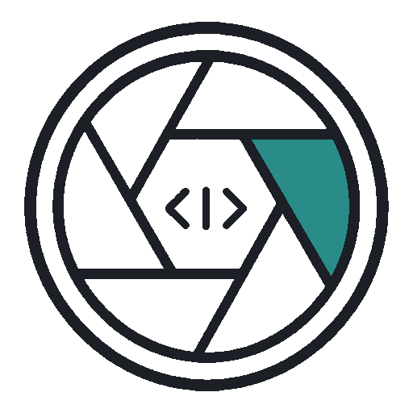

<p align="center">
  <picture>
    <source media="(prefers-color-scheme: dark)" srcset="docs/assets/logo-dark.png" />
    
  </picture>
</p>

<h1 align="center">RepoLens</h1>

<p align="center">
  <strong>Cursor Edition</strong><br/>
  Multi-lens code audits in <strong><a href="https://cursor.com/referral?code=UW6WJZLB8ECL">Cursor</a> IDE</strong> — findings as local files, without a separate agent CLI.
</p>

<p align="center">
  <a href="https://github.com/benjarogit/RepoLens-Cursor-Edition/actions/workflows/ci.yml"></a>
  <a href="LICENSE"></a>
  <a href="CHANGELOG.md"></a>
  <a href="https://github.com/benjarogit/RepoLens-Cursor-Edition"></a>
</p>

<!-- Contract badges (markdown form for CI; hidden duplicate of the row above) -->
<!--
[](https://github.com/benjarogit/RepoLens-Cursor-Edition/actions/workflows/ci.yml)
[](LICENSE)
[](CHANGELOG.md)
[](https://github.com/benjarogit/RepoLens-Cursor-Edition)
-->

<p align="center">
  <a href="https://benjarogit.github.io/RepoLens-Cursor-Edition/"></a>
</p>

<p align="center">
  <a href="https://github.com/TheMorpheus407/RepoLens"></a>
  <a href="https://cursor.com/referral?code=UW6WJZLB8ECL"></a>
</p>

<!-- README-I18N:START -->
<p align="center">
  <strong>English</strong> · <a href="README.de.md">Deutsch</a>
</p>
<!-- README-I18N:END -->

---

## Documentation

**All guides live on the docs site** (sidebar, search, English / Deutsch):

### → [RepoLens Cursor Edition Docs](https://benjarogit.github.io/RepoLens-Cursor-Edition/)

There you get the operator guide, IDE handoff, toolgate tool list, and CLI reference.  
Markdown sources stay in this repo under [`docs/en/`](docs/en/) and [`docs/de/`](docs/de/).

---

## What this is

Fork of [TheMorpheus407/RepoLens](https://github.com/TheMorpheus407/RepoLens) for **[Cursor](https://cursor.com/referral?code=UW6WJZLB8ECL) Composer/Agent**. Each *lens* is one focused review pass.

| | |
|---|---|
| **Agent** | `--agent cursor-ide` ([handoff guide](docs/cursor-ide.md)) |
| **Output** | `logs/<run-id>/` with `--local` |
| **Loop** | `REPOLENS_CTL` → prompt → response → hashed `complete.json` |

> [!IMPORTANT]
> Agents can run shell commands. Start with one domain (e.g. `--domain security`). Always use `--local`.

## Quick start

```bash
git clone https://github.com/benjarogit/RepoLens-Cursor-Edition.git
cd RepoLens-Cursor-Edition
chmod +x repolens.sh

export REPOLENS_IDE_AUTONOMOUS=1
./repolens.sh \
  --project /path/to/your/repo \
  --agent cursor-ide --local --domain security --yes
```


Multi-file product specs (`greenfield` / `spec-change`): `--spec-dir <dir>` with optional `--spec-entry`, `--spec-glob`, `--spec-exclude`. Details: [operator guide](docs/en/full-reference.md).

Need [Cursor](https://cursor.com/referral?code=UW6WJZLB8ECL)? Install it, open chat on this repo, then follow the [IDE handoff](https://benjarogit.github.io/RepoLens-Cursor-Edition/handoff/) when `REPOLENS_CTL` appears.

More: [docs site](https://benjarogit.github.io/RepoLens-Cursor-Edition/) · [upstream sync](UPSTREAM.md) · [changelog](CHANGELOG.md)

Set `REPOLENS_TEST_DOCKER=1` to also run integration tests requiring Docker.

## License

[Apache-2.0](LICENSE). See [NOTICE](NOTICE) for attribution. Upstream © Bootstrap Academy / TheMorpheus407; Cursor Edition under the same terms where applicable.

## Changelog

See [CHANGELOG.md](CHANGELOG.md).

## Contributing

See [CONTRIBUTING.md](CONTRIBUTING.md) and the [Code of Conduct](CODE_OF_CONDUCT.md).

## Security

Report vulnerabilities via [SECURITY.md](SECURITY.md) — do not open a public issue for security reports.

## Authors

See [AUTHORS.md](AUTHORS.md).
